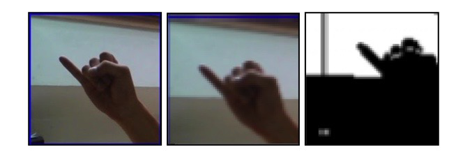
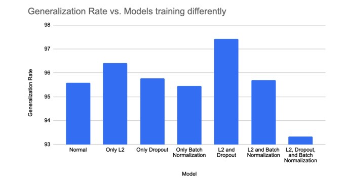

# ASL-Detection-Using-A-Neural-Network
ASL Fingerspelling Translation to Text Using a CNN

# Project Description
#### This is a group project for my machine learning class for which I worked primarily on model validation and the model's architecture. This program accepts images of ASL fingerspelling and classifies the input into one of 29 symbols: the 26 letters of the alphabet, space, delete, and nothing. We hoped to create something that would aid people who are deaf or hard of hearing and expand the accessibility of online products that target those groups. Towards this goal we combined two data sets we obtained from kaggle for a total of 164,500 images which we processed and used in our model training, validation, and testing.

#### Data sets: 
#### https://www.kaggle.com/grassknoted/asl-alphabet
#### https://www.kaggle.com/kuzivakwashe/significant-asl-sign-language-alphabet-dataset

# Data Preprocessing
#### Since much of our data was quite similar, we wanted to introduce some additional noise into our images to help prevent our model from overfitting. To do so, we adjusted the images via horizontal shifting, vertical shifting, and zooming to a random extent of 0 to 20%. 

#### We then wanted to segment each image into the object of focus and other elements which was especially important given the limited diversity in our images. We did not want to simply transform each image into black and white based on the RGB values of the pixels as variations in lighting and the background could erase portions of the hands. Instead we opted to use the YCrCb color space for segmenting our images as this space measures in order luminance, blue chroma (blueness controlled for luminance), and red chroma (redness controlled for luminance). The YCrCb space explicitly accounts for brightness and can recognize differences between pixels of the same brightness or find similarities between pixels of differing brightnesses that might be missed by simply using the RGB space and thus might prove advantageous for hand segmentation.

#### We then used a k-means approach to sort the pixels of each image into one of  two categories: hand or background. The k-means algorithm does not transform the image into black and white but rather into one of these two categories, but this process can be visualized by black and white pixels as shown below.

# Model Validation
#### After preprocessing our data, we separated our data randomly into three smaller subsets. We designated 60% of our data as a training data set, 20% as a validation data set, and 20% as a testing data set. Each model architecture was subsequently trained on our training data set and tested on the validation data set. Based on each model’s performance on the validation data set we would experiment with different hyperparameters and different combinations of layers with the goal of improving this performance. After we had selected our model, we used the test data set as an estimate of how the model would generalize and perform with data it had not previously encountered. 

# Model Architecture
#### Although there currently exists no set formula for building the ideal CNN for any given data set, there are general guidelines to abide by that we could infer by examining the architectures of various state of the art CNN models such as CifarNet, AlexNet, and GoogLeNet. We decided to alternate between convolutional and pooling layers, followed by some dense fully connected layers, and then we would use a dense layer with 29 units as the output layer. Due to computing and time constraints, we decided to experiment with mainly the amount of alternating convolutional and pooling layers and the amount of dense layers, and the filters and units hyperparameters for the convolutional and dense layers respectively. All of the convolutional and dense layers in our model used the reLu activation function, with the exception of our output layer which instead used the softmax activation function.

#### We first began by experimenting with both the number of filters per convolutional layer and the amount of alternating convolutional and pooling layers in the model. Tables 1 through 4 show the model’s performance across ten epochs for the filter variations we tested. As shown in the data, generally performance for each set of alternating sets of convolutional and pooling layers improved as we increased the filter sizes across the layers. Performance also generally increased with additional convolution and pooling layers. Increasing the amount of filters greatly increases the time it takes for the model to train though, as the 64, 128, 128 variant of table 3 took about 2.5 hours just to fit while the 16, 32, 64 variant took only 15 minutes to fit. Therefore, when taking into consideration both performance and the time it took for the model to train, we opted to 3 sets of alternating convolution and pooling layers with 16, 32, and 64 filters for the 3 convolutional layers respectively.

##### Table 1
| Filters | Epoch 1 | Epoch 2 | Epoch 3 | Epoch 4 | Epoch 5 | Epoch 6 | Epoch 7 | Epoch 8 | Epoch 9 | Epoch 10 |
|:-------:|:-------:|:-------:|:-------:|:-------:|:-------:|:-------:|:-------:|:-------:|:-------:|:--------:|
| 16      | 0.6296  | 0.7078  | 0.7320  | 0.7372  | 0.7441  | 0.7431  | 0.7439  | 0.7434  | 0.7478  | 0.7422   |
| 32      | 0.6882  | 0.7327	| 0.7570	| 0.7608	| 0.7653	| 0.7666	| 0.7640  | 0.7657  | 0.7619	| 0.7662   |   
| 64      | 0.6986  | 0.7492	| 0.7582	| 0.7642	| 0.7703	| 0.7687	|0.7691	  | 0.7686	| 0.768	  | 0.7701   |
| 128     | 0.7285  | 0.7658	| 0.7714	| 0.7798	| 0.7749	| 0.7798	| 0.7762	| 0.7758	| 0.7765	| 0.7776   |

#### Table 2
| Filters  | Epoch 1 | Epoch 2 | Epoch 3 | Epoch 4 | Epoch 5 | Epoch 6 | Epoch 7 | Epoch 8 | Epoch 9 | Epoch 10 |
|:--------:|:-------:|:-------:|:-------:|:-------:|:-------:|:-------:|:-------:|:-------:|:-------:|:--------:|
| 16, 32   | 0.7310	| 0.7976  | 0.8284	| 0.8397	| 0.8418	| 0.8438	| 0.8507	| 0.8521  | 0.8447	| 0.8502   |
| 32, 64   | 0.7664	| 0.8254	| 0.8468	| 0.8542	| 0.8548	| 0.8570	| 0.8599	| 0.8578	| 0.8582	| 0.8591   |
| 64, 128  | 0.8115	| 0.8628	| 0.8729	| 0.8805	| 0.8746	| 0.8812	| 0.8867	| 0.8834	| 0.8833	| 0.8837   |
| 128, 128 | 0.8121	| 0.8584  | 0.8641	| 0.8766	| 0.8719	| 0.8770	| 0.8774	| 0.8808	| 0.8781	| 0.8751   |

#### Table 3
| Filters      | Epoch 1 | Epoch 2 | Epoch 3 | Epoch 4 | Epoch 5 | Epoch 6 | Epoch 7 | Epoch 8 | Epoch 9 | Epoch 10 |
|:------------:|:-------:|:-------:|:-------:|:-------:|:-------:|:-------:|:-------:|:-------:|:-------:|:--------:|
| 16, 32, 64   | 0.7540	 | 0.8274	 | 0.8519	 | 0.8808	 | 0.8949	 | 0.8834	 | 0.8971	 | 0.8963	 | 0.9036	 | 0.9113   |
| 32, 64, 128  | 0.8139	 | 0.8732	 | 0.8998	 | 0.9128	 | 0.9159	 | 0.9196	 | 0.9236	 | 0.9169	 | 0.9225	 | 0.9281   |
| 64, 128, 128 | 0.8260	 | 0.8892	 | 0.9156	 | 0.9168	 | 0.9231	 | 0.9309	 | 0.9241	 | 0.9321	 | 0.9374	 | 0.9301   |

#### Table 4
| Filters         | Epoch 1 | Epoch 2 | Epoch 3 | Epoch 4 | Epoch 5 | Epoch 6 | Epoch 7 | Epoch 8 | Epoch 9 | Epoch 10 |
|:---------------:|:-------:|:-------:|:-------:|:-------:|:-------:|:-------:|:-------:|:-------:|:-------:|:--------:|
| 16, 32, 64, 128 | 0.7431	| 0.8230  | 0.8639	| 0.8767	| 0.8922	| 0.9013	| 0.9018	| 0.9096	| 0.9131	| 0.9107   |

#### As shown in tables 5 and 6, the addition of a dense layer greatly increased the model’s performance but the relationship between additional units in a layer and overall performance is much less transparent. Adding a second dense layer did not seem to greatly affect the model’s performance, so we opted to just use a single dense layer with 1000 units since the 1000 unit variant did perform slightly better than its 500 and 250 unit counterparts.

#### Table 5
| Units | Epoch 1 | Epoch 2 | Epoch 3 | Epoch 4 | Epoch 5 | Epoch 6 | Epoch 7 | Epoch 8 | Epoch 9 | Epoch 10 |
|:-----:|:-------:|:-------:|:-------:|:-------:|:-------:|:-------:|:-------:|:-------:|:-------:|:--------:|
| 250   | 0.8489	| 0.9009	| 0.9219	| 0.9360	| 0.9429	| 0.9448	| 0.9463	| 0.9480	| 0.9460	| 0.9542   |
| 500   | 0.8737	| 0.9205	| 0.9266	| 0.9439	| 0.9516	| 0.9446	| 0.9555	| 0.9531	| 0.9553	| 0.9563   |
| 750   | 0.8903	| 0.9308	| 0.9464	| 0.9507	| 0.9563	| 0.9494	| 0.9578	| 0.9586	| 0.9595	| 0.9626   |
| 1000  | 0.8754	| 0.9179	| 0.9332	| 0.9385	| 0.9492	| 0.9514	| 0.9535	| 0.9503	| 0.9536	| 0.9512   |

#### Table 6
| Units      | Epoch 1 | Epoch 2 | Epoch 3 | Epoch 4 | Epoch 5 | Epoch 6 | Epoch 7 | Epoch 8 | Epoch 9 | Epoch 10 |
|:----------:|:-------:|:-------:|:-------:|:-------:|:-------:|:-------:|:-------:|:-------:|:-------:|:--------:|
| 1000, 1000 | 0.8767  |0.9325	 |0.9501	 |0.9545	 |0.9552	 |0.9626	 |0.9629	 |0.9639	 |0.9614	 |0.9644    |
| 1000, 500  | 0.8753	 |0.9201	 |0.9360	 |0.9466	 |0.9488	 |0.9528	 |0.9572	 |0.9609	 |0.9540	 |0.9606    |

# Regularization
#### We experimented with Batch Normalization, Dropout, and L2 regularization. Many of the methods we tested did in fact result in increased generalization performance, but others actually decreased generalization performance. Additionally, some methods worked better on their own while others worked better when combined with other techniques. By using both L2 regularization in tandem with dropout layers, we achieved a final generalization rate of 97.43% for our model.

# Results
#### Our model had an accuracy of 97.43% on our test data set. The most common mistake was the model misinterpreting the asl sign for “r” as “u”, which is understandable as the asl signs for these two letters are quite similar.

